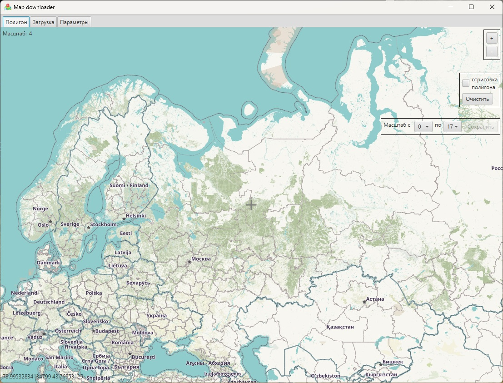

# mapWidget
MapWidget (including offline) for JavaFx

Молуль написанный на JavaFx для отображения тайлов карт от Yandex, Google, OSM серверов, а так же из локальной директории

Пример использования. Программа по выкачки картографической информации.

